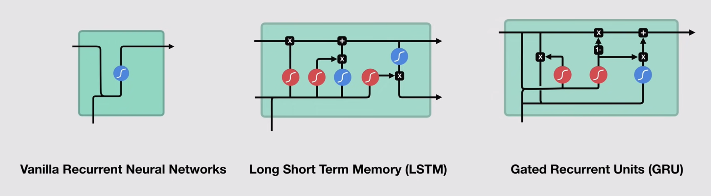
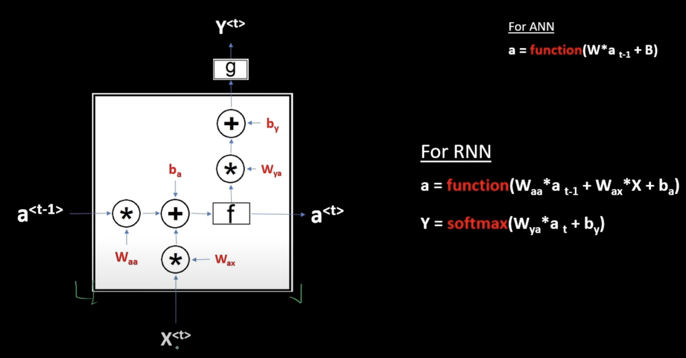
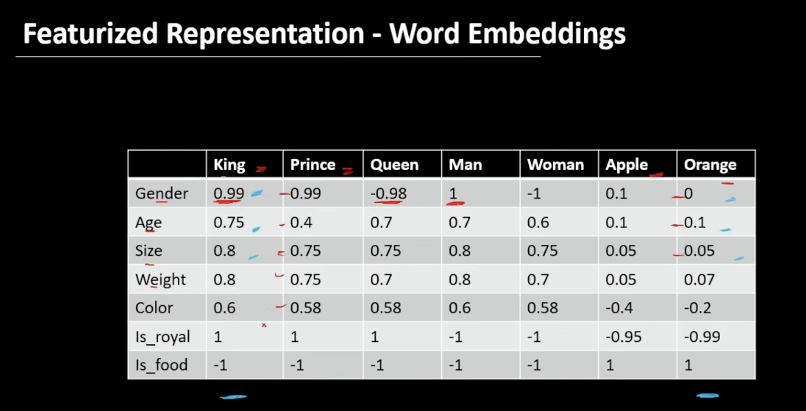
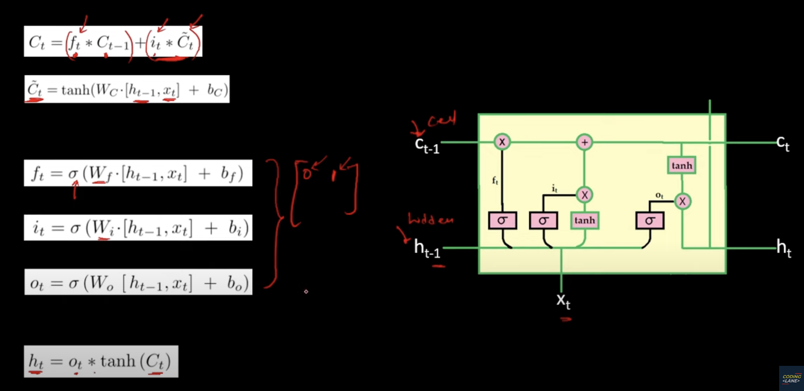
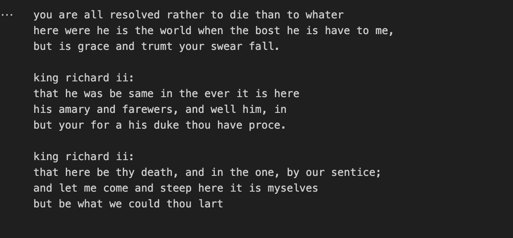

# Text Generation using LSTM on Shakespeare's Writings

## 1. Introduction

This report presents an implementation of a text generation model using a Long Short-Term Memory (LSTM) network, a type of Recurrent Neural Network (RNN). The objective is to train the model on a dataset of Shakespeare's writings and generate new text that mimics the style of the original data. By understanding and applying RNNs to this task, we gain insights into their effectiveness in modeling sequential data and generating coherent text.

#### RNN LSTM and GRU 

#### RNN Cell

## 2. Dataset

The dataset used for this project consists of a collection of Shakespeare's writings, which is a popular choice for text generation tasks. The dataset is in plain text format and is loaded into the program using the `io` library in Python. The text is converted to lowercase to reduce the vocabulary size and simplify the learning process.

## 3. Data Preprocessing

To prepare the data for training the LSTM model, several preprocessing steps are performed:

1. **Character mapping**: The unique characters in the text are identified and mapped to integer indices using dictionaries (`char_indices` and `indices_char`). This allows for efficient encoding of the text as numerical sequences.

2. **Sequence creation**: The text is divided into sequences of fixed length (`maxlen`) with a specified step size. Each sequence represents an input to the model, and the corresponding target is the character that follows the sequence. This sliding window approach creates a large number of training examples.

3. **Vectorization**: The input sequences and target characters are converted into binary vectors using one-hot encoding. This representation is suitable for training the LSTM model.

## 4. Model Architecture

The LSTM model is implemented using the Keras library with the following architecture:

- An LSTM layer with 128 units, taking input sequences of length `maxlen` and the number of unique characters.
- A Dense output layer with the same number of units as the number of unique characters, activated by the softmax function.

The model is compiled with the categorical cross-entropy loss function and the RMSprop optimizer with a learning rate of 0.01.

#### LSTM Cell

## 5. Training and Validation

The preprocessed data is split into training, validation, and test sets using the `train_test_split` function from scikit-learn. The model is trained on the training set for a specified number of epochs (in this case, 2) with a batch size of 128. The validation set is used to monitor the model's performance during training and prevent overfitting.

Validation loss: 1.612

After training, the model is saved to disk using the `save` method to preserve the learned weights and architecture for future use.

## 6. Model Evaluation

After training, the model's performance is evaluated on the test set using the `evaluate` method. The test loss is calculated and printed to assess how well the model generalizes to unseen data.

Test loss: 1.621

## 7. Text Generation

To generate new text, a seed sentence is provided as a starting point. The model predicts the next character based on the current sequence of characters. The prediction is made using the `predict` method of the trained model, and the next character is sampled from the predicted probability distribution using a temperature parameter to control the randomness.

The generated text is obtained by iteratively appending the predicted characters to the seed sentence. In this example, 400 characters are generated.

#### Sample Generated Text

## 8. Results and Discussion

The generated text demonstrates that the LSTM model has learned to capture the style and structure of Shakespeare's writings to some extent. However, the generated text may not always be coherent or meaningful, especially for longer sequences. This is a common challenge in text generation tasks, as the model struggles to maintain long-term dependencies and generate semantically consistent text.

Improving the quality of the generated text would require further experimentation with the model architecture, hyperparameters, and training strategies. Techniques such as beam search, top-k sampling, or temperature scaling can be explored to enhance the coherence and diversity of the generated text.

## 9. Conclusion

In this project, we implemented an LSTM-based text generation model trained on Shakespeare's writings. The model successfully learned to generate text that resembles the style of the original data. However, generating coherent and meaningful text remains a challenge, especially for longer sequences.

This project highlights the potential of RNNs, particularly LSTMs, in modeling sequential data and generating text. It also emphasizes the importance of data preprocessing, model architecture design, and careful evaluation in achieving satisfactory results.

Future work could involve exploring more advanced architectures, such as Transformer models, and incorporating techniques like attention mechanisms and transfer learning to improve the quality and coherence of the generated text.